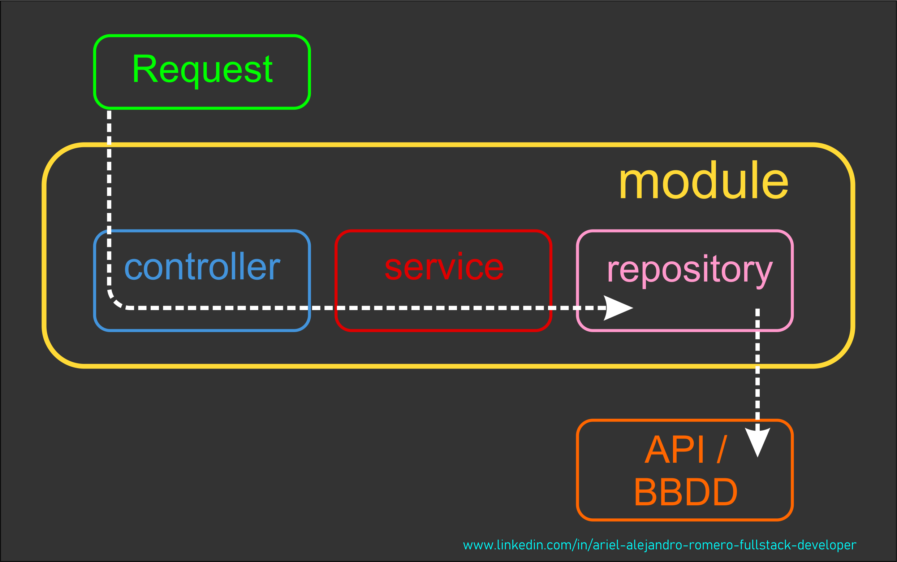
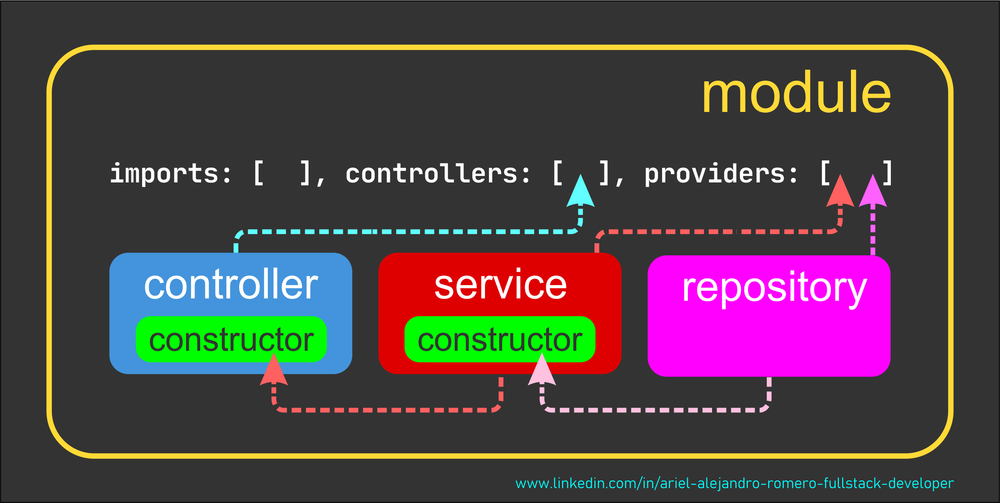

# Nest JS - Nest JS Fundamentals II

[Volver a Inicio](../README.md)

## Links

- [JOSN Placeholder](https://jsonplaceholder.typicode.com/users)
- [Obsidian - Página Oficial](https://obsidian.md/)
- [Obsidian - Primeros Pasos](https://www.youtube.com/watch?v=64pI_dKYZOg)

## 🎯Repositorios

- La lógica de la solicitud a una fuente externa puede realizarse dentro de un Servicio, pero NO es una buena práctica.
- Un servicio puede hacer uso de múltiples repositorios.
- Un Repositorio es una clase "Inyectable" que serán utilizadas por otras clases.
  - SE TRATA DE UN PROVIDER

## 🎯 Repaso de Nest JS

- NestJS es un framework para construir aplicaciones del lado del servidor utilizando TypeScript y basado en conceptos de:
  - Diseño de "Arquitectura Modular" y en patrones de diseño como Inversión de Control (IoC).
  - La "inyección de dependencias", que hace mucho mas eficiente al utilizar una sola Instancia en todo el código. Ejemplo de instancia de BBDD.
- **Módulos**
  - **Función**: Agrupar y organizar el código relacionado por entidades.
  - **Características**: Usa `@Module()`, encapsula componentes relacionados, facilita la reutilización.
- **Controladores**
  - **Función**: Gestionar rutas y solicitudes HTTP, desestructurar información y dar respuesta al Cliente.
    - **Características**: Usa `@Controller()`, define rutas, interactúa con servicios.
- **Servicios**
  - **Función**: Contener la lógica de negocio.
  - **Características**: Usa `@Injectable()`, implementa métodos de negocio, interactúa con repositorios.
- **Repositorios**
  - **Función**: Manejar la interacción con la base de datos u otras APIs.
  - **Características**: Usa `@EntityRepository()`, proporciona abstracción sobre CRUD, define métodos personalizados. Es quien interactúa con los ORMs. (Object Relational Mapping).

## Flujo del Request

## Inyección de Dependencias

