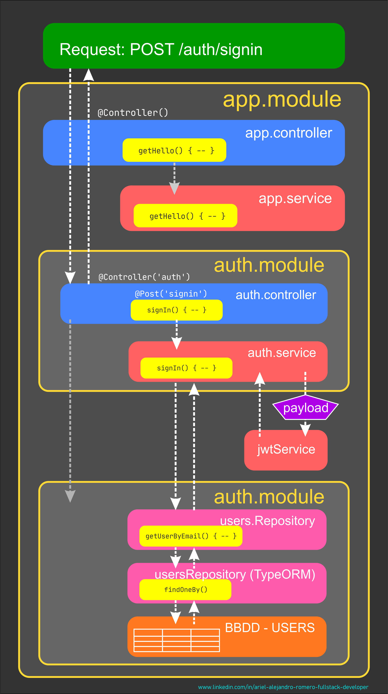

# Nest JS - Nest JS Testing

[Volver a Inicio](../README.md)

## Flow General del Proyecto

## Testing

El testing en NestJS es un proceso fundamental para asegurar que las aplicaciones funcionen correctamente, permitiendo verificar el comportamiento de los componentes de manera aislada y asegurando la calidad del código. NestJS facilita la realización de pruebas utilizando Jest como framework de testing por defecto, pero puede integrarse con otros frameworks de pruebas si se desea.

### Tipos de Testing en NestJS

#### Unit Testing (Pruebas Unitarias):

Se enfocan en probar unidades de código individuales, como controladores o servicios, en aislamiento.
En NestJS, puedes utilizar Mocks y Stubs para simular dependencias y concentrarte en la lógica de la unidad que estás probando.
Se realizan utilizando las clases reales o mediante el uso de inyecciones falsas para reemplazar dependencias.

#### Integration Testing (Pruebas de Integración):

Estas pruebas verifican cómo interactúan varios módulos o componentes entre sí.
En NestJS, se utiliza un test module para simular el entorno del módulo real y se prueban las interacciones entre diferentes dependencias (por ejemplo, servicios y controladores).
A menudo se configuran con bases de datos en memoria como SQLite o MongoDB in-memory para pruebas más rápidas y realistas.

#### End-to-End Testing (E2E):

Este tipo de pruebas se enfoca en probar el sistema completo, emulando la interacción del usuario con la API.
Se utiliza una instancia real del servidor NestJS, para verificar que todo el flujo de la aplicación funciona correctamente.
Se emplea supertest junto con Jest para hacer peticiones HTTP y verificar las respuestas.

### Herramientas para Testing en NestJS

- Jest: Framework por defecto para realizar pruebas en NestJS. Es potente, flexible y ampliamente utilizado en el ecosistema de Node.js.
- Supertest: Utilizado en pruebas de integración y E2E para realizar peticiones HTTP y validar respuestas.
- Test Utilities de NestJS: La función Test.createTestingModule() permite crear un entorno de prueba que emula los módulos de la aplicación real para pruebas unitarias e integradas.

### Beneficios del Testing en NestJS

- Confiabilidad: Garantiza que los componentes funcionen como se espera a lo largo del tiempo.
- Mantenimiento: Facilita la identificación y corrección de errores, permitiendo que el código sea más fácil de mantener.
- Documentación: Las pruebas sirven como documentación viviente del comportamiento de la aplicación.
- Prevención de Regresiones: Ayuda a evitar que nuevas actualizaciones o cambios en el código introduzcan errores no deseados.
